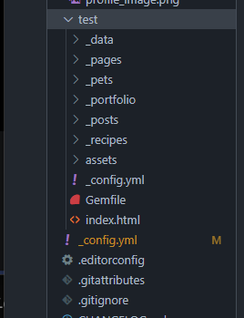

#### Jekyll _config.yml memo

---

- 블로그 세팅 :

  - \_config.yml에서 수정.
  - `breadcrumbs: false # true, false (default)` << 네비게이션 세팅.
  - Defaults -> values: 아래에 `show_date : true` << 포스팅 날짜

   values 밖에서 `date_format: "%Y-%m-%d"` << 연월일

  - 구글 애널리틱스:

   Analytics >> provider "google" >> tracking_id 입력.

   _Google tag manager 관련 세팅은 추후에!_

   `pagenate` : 포스팅 글을 몇개씩 보여줄 것인지 설정.
  
  - `toc` 기능 : Table of contents. vscode에서 포스트 상단에 `toc: true`
  
    게시글 우측에 해당 게시글의 목차를 보여주는 기능인데, typora와 같은 markdown 에디터에서 `heading`제목 문법으로 쓰여진 텍스트를 보여주는 것 같다. (해당 text를 '## ### ####' 등으로 heading으로 적을 수 있다.)
  
  - `404error` : 오류 페이지를 보여줄 때 사용할 건데, minimal mistake 테마 test 폴더에서 예제를 만들어서 제공해주고 있다.
  
    그런데 왜 오류페이지 내보낼때 하필 `404` 일까? 
  
    위키에는 404 오류의 첫번째 숫자 4는 클라이언트 오류를 의미하고, 두 자리 숫자는 상세 내용을 의미한다고 소개되어 있다. 서버를 찾았으나 해당 서버 내에서 파일을 찾기 못했을 때 return한다.
  
     vscode에서 _pages >> 404.md 파일을 생성하고 test폴더의 404.md 파일내용을 복사 붙여넣기 한다. 기본 문구는 지우고 적당한 404error 이미지를 넣어서 꾸밀 수 있다.
  
     나의 경우는 assets >> image 폴더에 해당 이미지를 넣고 typora에서 _pages >> 404.md에 이미지를 넣었다.
  
     
  
     이렇게 했더니 해당 이미지가 이쁘지 않게 삽입이 되었다. 지우고 html의 p태그와 img 태그로 가운데 정렬했다.
  
    ```
    <p align= "center">
    	
    </p>
    ```
  
    
  
  - 
  
  


#### **Debugging**

------

 local에서 jekyll 블로그를 돌리다가 다음과 같은 에러가 발생했다.

```
Dependency Error: Yikes! It looks like you don't have tzinfo or one of its dependencies installed. In order to use Jekyll as currently configured, you'll need to install this gem. If you've run Jekyll with `bundle exec`, ensure that you have included the tzinfo gem in your Gemfile as well. The full error message from Ruby is: 'cannot load such file -- tzinfo' If you run into trouble, you can find helpful resources at https://jekyllrb.com/help/!
```

구글링을 하면서 갖가지 방법을 써보고 노력하다가 LLM의 도움을 받았더니 한번에 해결했다. 에러 핵심은 `tzinfo`(windows에서는 `tzinfo-data`) gem이 로드되지 않아서 Jekyll이 타임존 설정 단계에서 멈춘 것이었다. Windows에서 Jekyll 4.X는 타임존 계산에 `tzinfo`를 쓴다.


```ruby
source "https://rubygems.org"

# Jekyll 본체
gem "jekyll", "~> 4.4.1"

# Windows에서 타임존 계산에 필요
gem "tzinfo", "~> 2.0"
gem "tzinfo-data"

# Ruby 3.x에서 jekyll serve에 종종 필요
gem "webrick", "~> 1.8"

```

를 gemfile에 추가한 후 다시 로컬서버를 실행했더니 오류가 해결되었다.

*(2025-10-01-02:11 am)*

이후 다시 tag작업을 하다가 다시 로컬서버가 다운되었다. 그 짧은 시간에 내가 무엇을 했나 생각해보니 yaml말머리 tag에 "" 따옴표를 넣었더니 바로 다운되었다. 왜 그런지 나중에 알아봐야겠다.


#### **기억해야 할 것**

------


- [ ] Google tag manager 나중에 설정

- [ ] email footer 중복인지 check

- [ ] yaml 말머리 tag에 " " 넣는 순간 서버가 다운되는 이유는?

- [ ] local subtitle 한글은 잘 나오는데 호스팅 서버는 안나오는 이유는? 

- [ ] 기타 :

  - typora에서 키보드 tab 위에 ` 3번 입력 >> python >> enter 하면 python 코드 입력 가능.

  - vscode 주석 단축키 :

    `ctrl + k` >> `ctrl + c` # 주석 여러줄 처리

    `ctrl + k` >> `ctrl + u` # 주석 여러줄 해제
